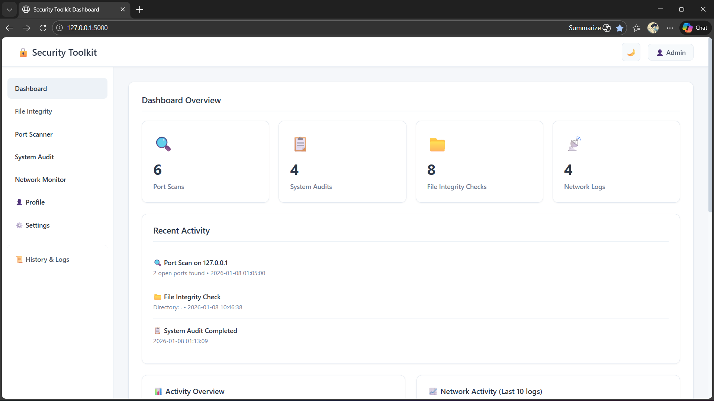
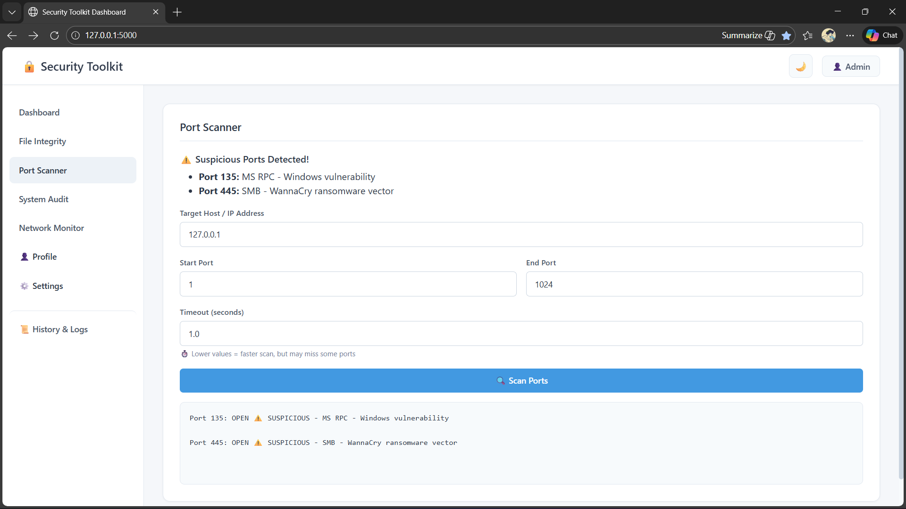
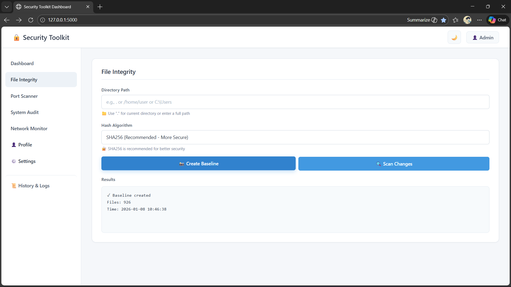
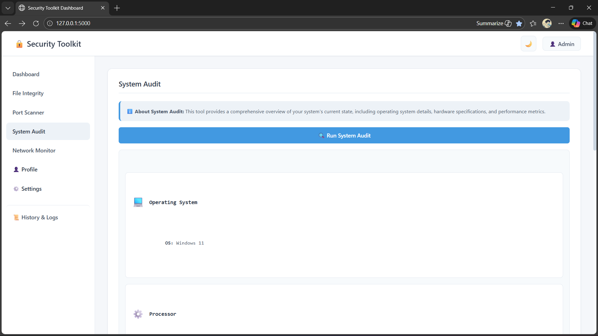
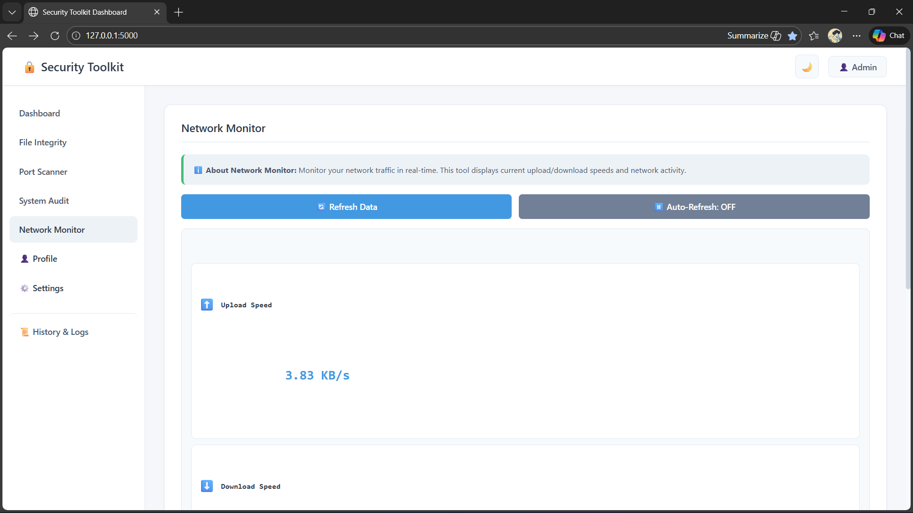

# 🔒 Security Toolkit

A comprehensive web-based security monitoring and auditing toolkit built with Flask. This application provides multiple security tools including port scanning, file integrity monitoring, system auditing, and network monitoring with enterprise-grade security features.


---

## 📋 Table of Contents

- [Features](#features)
- [Security Features](#security-features)
- [Screenshots](#screenshots)
- [Installation](#installation)
- [Configuration](#configuration)
- [Usage](#usage)
- [API Documentation](#api-documentation)
- [Security Best Practices](#security-best-practices)
- [Project Structure](#project-structure)
- [Technologies Used](#technologies-used)
- [Contributing](#contributing)
- [License](#license)
- [Author](#author)

---

## ✨ Features

### 🔍 **Port Scanner**
- Multi-threaded TCP port scanning (up to 1000 threads)
- Banner grabbing for service identification
- HTTP/HTTPS protocol detection
- Suspicious port detection with security warnings
- Configurable timeout and port ranges
- Visual alerts for potentially dangerous ports

### 📁 **File Integrity Monitor**
- Baseline creation with multiple hash algorithms (SHA-256, MD5, SHA-1)
- Real-time change detection (added, modified, removed files)
- JSON-based baseline storage
- Support for custom directories
- Detailed scan reports

### 💻 **System Audit**
- Operating system information
- CPU and RAM monitoring
- Real-time resource usage tracking
- System uptime and boot time
- Hardware specifications
- Performance metrics visualization

### 📡 **Network Monitor**
- Real-time upload/download speed monitoring
- Network activity tracking
- Historical data with charts
- Auto-refresh capability
- Statistics tracking (average speeds, total refreshes)

### 📊 **History & Logs**
- Comprehensive activity history
- Search and filter functionality
- Date range filtering (Today, Last 7 Days, Last 30 Days)
- Export to PDF and CSV formats
- Detailed scan results storage

### 📈 **Dashboard**
- Overview of all security activities
- Real-time statistics
- Interactive charts (Network activity, Port scans, System performance)
- Recent activity feed
- Quick access to all tools

---

## 🛡️ Security Features

### 1. **CSRF Protection**
- Automatic CSRF token generation for all forms
- Protection against cross-site request forgery attacks
- Implemented using Flask-WTF

### 2. **Advanced Password Security**
- PBKDF2 hashing with SHA-256
- Automatic salt generation per password
- Protection against rainbow table attacks
- Secure password reset functionality

### 3. **Rate Limiting**
Prevents brute-force attacks with configurable limits:
- Login: 5 attempts per minute
- Registration: 10 per hour
- Password reset: 3 per hour
- Port scanning: 10 per minute
- File operations: 20 per hour
- API endpoints: Various limits

### 4. **Input Validation**
- WTForms-based validation for all forms
- Custom validators for hostnames and IP addresses
- Path traversal protection
- Length and format checking
- XSS and SQL injection prevention

### 5. **Comprehensive Logging**
- All activities logged with timestamps
- Rotating file handler (10MB max, 5 backups)
- Security event tracking
- Failed login attempt monitoring
- Error tracking and debugging

### 6. **Environment-Based Configuration**
- Secrets stored in `.env` file
- Separate configuration for development/production
- No hardcoded credentials in source code

---

## 📸 Screenshots

### Dashboard


### Port Scanner


### File Integrity Monitor


### System Audit


### Network Monitor

---

## 🚀 Installation

### Prerequisites
- Python 3.8 or higher
- pip (Python package manager)
- Virtual environment (recommended)

### Step 1: Clone the Repository
```bash
git clone https://github.com/yourusername/security-toolkit.git
cd security-toolkit
```

### Step 2: Create Virtual Environment
```bash
# Windows
python -m venv venv
venv\Scripts\activate

# Linux/Mac
python3 -m venv venv
source venv/bin/activate
```

### Step 3: Install Dependencies
```bash
pip install -r requirements.txt
```

### Step 4: Configure Environment Variables
```bash
# Copy the example file
cp .env.example .env

# Generate a secure secret key
python -c "import secrets; print(secrets.token_hex(32))"

# Edit .env and add your generated key
nano .env  # or use any text editor
```

**Important:** Replace `SECRET_KEY` in `.env` with your generated key:
```env
SECRET_KEY=your_generated_secret_key_here
DEBUG=true
DB_FILE=security_toolkit.db
LOG_FILE=security_toolkit.log
LOG_LEVEL=INFO
```

### Step 5: Initialize Database
```bash
python app.py
```

The database will be created automatically on first run.

### Step 6: Access the Application
Open your browser and navigate to:
```
http://127.0.0.1:5000
```

**Default Credentials:**
- Username: `admin`
- Password: `admin123`

⚠️ **IMPORTANT:** Change the default password immediately after first login!

---

## ⚙️ Configuration

### Environment Variables

Create a `.env` file in the root directory:

```env
# Flask Configuration
SECRET_KEY=your-secret-key-here
DEBUG=false
FLASK_ENV=production

# Database
DB_FILE=security_toolkit.db

# Rate Limiting
RATELIMIT_ENABLED=true
RATELIMIT_STORAGE_URL=memory://

# Default Admin (only used on first run)
DEFAULT_ADMIN_USERNAME=admin
DEFAULT_ADMIN_PASSWORD=admin123

# Logging
LOG_FILE=security_toolkit.log
LOG_LEVEL=INFO
```

### Log Levels
- **DEBUG**: Detailed information for diagnosing problems
- **INFO**: General informational messages (recommended)
- **WARNING**: Warning messages
- **ERROR**: Error messages
- **CRITICAL**: Critical messages

---

## 📖 Usage

### User Management

#### Registration
1. Navigate to `/register`
2. Choose a unique username (3-50 characters, alphanumeric + underscores)
3. Create a strong password (minimum 6 characters)
4. Confirm password
5. Click "Register"

#### Login
1. Navigate to `/login`
2. Enter username and password
3. Click "Login"

#### Password Reset
1. Navigate to `/forgot_password`
2. Enter your username
3. Set a new password
4. Confirm password
5. Click "Reset Password"

### Port Scanner

1. Navigate to **Port Scanner** from the sidebar
2. Enter target host/IP address (e.g., `127.0.0.1`, `example.com`)
3. Set start port (default: 1)
4. Set end port (default: 1024)
5. Set timeout in seconds (default: 1.0)
6. Click **"🔍 Scan Ports"**

**Results include:**
- Open ports with services
- Banner information
- Suspicious port warnings
- Service identification

### File Integrity Monitor

#### Create Baseline
1. Navigate to **File Integrity**
2. Enter directory path (use `.` for current directory)
3. Select hash algorithm (SHA256 recommended)
4. Click **"📸 Create Baseline"**

#### Scan for Changes
1. Click **"🔍 Scan Changes"**
2. Review detected changes:
   - ⚠️ Modified files
   - ❌ Deleted files
   - ✅ New files

### System Audit

1. Navigate to **System Audit**
2. Click **"🔍 Run System Audit"**

**Information collected:**
- Operating system details
- CPU information and usage
- RAM capacity and usage
- System uptime
- Boot time

### Network Monitor

1. Navigate to **Network Monitor**
2. Click **"🔄 Refresh Data"** for one-time reading
3. Click **"⏸️ Auto-Refresh: OFF"** to enable continuous monitoring

**Metrics tracked:**
- Upload speed (KB/s)
- Download speed (KB/s)
- Average speeds
- Total refresh count

### History & Logs

1. Navigate to **📜 History & Logs**
2. Switch between tabs:
   - 🔍 Port Scans
   - 📋 System Audits
   - 📁 File Integrity
   - 📡 Network Logs
3. Use search box to filter results
4. Use date filter for time-based filtering
5. Export data:
   - **📄 Export PDF** - Formatted report
   - **📊 Export CSV** - Spreadsheet data

---

## 🔌 API Documentation

### Authentication Endpoints

#### Register User
```http
POST /register
Content-Type: application/x-www-form-urlencoded

username=testuser&password=password123&confirm_password=password123
```

#### Login
```http
POST /login
Content-Type: application/x-www-form-urlencoded

username=testuser&password=password123
```

#### Logout
```http
GET /logout
```

### Security Tool Endpoints

#### Port Scan
```http
POST /api/scan_ports
Content-Type: application/json
Authorization: Required (Session)

{
  "host": "127.0.0.1",
  "start_port": 1,
  "end_port": 1024,
  "timeout": 1.0
}
```

**Response:**
```json
{
  "timestamp": "2026-01-08 10:30:15",
  "results": [
    {
      "port": 80,
      "status": "OPEN",
      "banner": "Apache/2.4.41",
      "service": "HTTP",
      "suspicious": true,
      "warning": "HTTP - Unencrypted web traffic"
    }
  ]
}
```

#### Create File Baseline
```http
POST /api/create_baseline
Content-Type: application/json
Authorization: Required (Session)

{
  "directory": ".",
  "algorithm": "sha256"
}
```

**Response:**
```json
{
  "status": "Baseline created",
  "timestamp": "2026-01-08 10:30:15",
  "files": 42
}
```

#### Scan File Changes
```http
GET /api/scan_changes
Authorization: Required (Session)
```

**Response:**
```json
{
  "results": [
    "Scan Report (Added: 2, Removed: 1, Modified: 3)",
    "⚠️ MODIFIED FILES:",
    "   - ./app.py",
    "✅ NEW FILES:",
    "   - ./new_file.txt"
  ]
}
```

#### Run System Audit
```http
GET /api/run_audit
Authorization: Required (Session)
```

**Response:**
```json
{
  "os": "Linux",
  "release": "5.15.0",
  "cpu": "Intel Core i7-9700K",
  "ram": 16.0,
  "ram_usage": "45.2%",
  "boot_time": "2026-01-07 08:00:00",
  "uptime": "1 day, 2:30:15",
  "cpu_usage": "23.5%"
}
```

#### Get Network Info
```http
GET /api/network_info
Authorization: Required (Session)
```

**Response:**
```json
{
  "upload": 45.67,
  "download": 123.45,
  "timestamp": "2026-01-08 10:30:15"
}
```

### Data Endpoints

#### Dashboard Statistics
```http
GET /api/dashboard_stats
Authorization: Required (Session)
```

#### History Data
```http
GET /api/history_data
Authorization: Required (Session)
```

#### Export Reports
```http
GET /export/{report_type}/{format}
Authorization: Required (Session)

# Examples:
GET /export/port_scans/pdf
GET /export/audits/csv
GET /export/file_checks/pdf
GET /export/network_logs/csv
```

---

## 🔐 Security Best Practices

### For Developers

1. **Never commit `.env` file**
   - Always use `.gitignore`
   - Store secrets securely

2. **Generate strong SECRET_KEY**
   ```bash
   python -c "import secrets; print(secrets.token_hex(32))"
   ```

3. **Use HTTPS in production**
   - Configure SSL/TLS certificates
   - Use reverse proxy (Nginx/Apache)

4. **Regular security updates**
   ```bash
   pip install --upgrade -r requirements.txt
   ```

5. **Monitor logs regularly**
   ```bash
   tail -f security_toolkit.log
   grep "ERROR\|Login failed" security_toolkit.log
   ```

### For Users

1. **Change default password immediately**
2. **Use strong, unique passwords**
3. **Enable two-factor authentication** (if implemented)
4. **Regularly review activity logs**
5. **Log out after each session**

### Production Deployment

1. Set `DEBUG=false` in `.env`
2. Use strong SECRET_KEY
3. Configure HTTPS
4. Set up firewall rules
5. Enable log rotation
6. Regular database backups
7. Monitor failed login attempts
8. Use production-grade server (Gunicorn/uWSGI)

**Example Gunicorn deployment:**
```bash
pip install gunicorn
gunicorn -w 4 -b 0.0.0.0:5000 app:app
```

---

## 📁 Project Structure

```
security-toolkit/
├── app.py                      # Main Flask application
├── forms.py                    # WTForms validation classes
├── scanner.py                  # Port scanning module
├── integrity.py                # File integrity monitoring
├── requirements.txt            # Python dependencies
├── .env                        # Environment variables (DO NOT COMMIT!)
├── .env.example               # Example environment file
├── .gitignore                 # Git ignore rules
├── README.md                   # This file
├── security_toolkit.db         # SQLite database (auto-created)
├── security_toolkit.log        # Application logs (auto-created)
├── baseline.json               # File integrity baseline (auto-created)
│
├── static/
│   └── style.css              # CSS styles
│
└── templates/
    ├── index.html             # Dashboard
    ├── login.html             # Login page
    ├── register.html          # Registration page
    ├── forgot_password.html   # Password reset
    ├── history.html           # History and logs
    ├── 404.html               # Not found page
    └── 500.html               # Server error page
```

---

## 🛠️ Technologies Used

### Backend
- **Flask 3.0.0** - Web framework
- **SQLite3** - Database
- **Werkzeug 3.0.1** - WSGI utilities and password hashing
- **Flask-WTF 1.2.1** - Form handling and CSRF protection
- **WTForms 3.1.1** - Form validation
- **Flask-Limiter 3.5.0** - Rate limiting
- **python-dotenv 1.0.0** - Environment variable management

### Security & Monitoring
- **psutil 5.9.6** - System and network monitoring
- **hashlib** - Cryptographic hashing

### Reports & Export
- **ReportLab 4.0.7** - PDF generation
- **csv** - CSV file handling

### Frontend
- **HTML5/CSS3** - Modern web standards
- **JavaScript (Vanilla)** - Dynamic interactions
- **Bootstrap 5.3.3** - Responsive UI framework
- **Chart.js 4.4.0** - Data visualization

---

## 🧪 Testing

### Manual Testing

1. **Authentication Testing**
   ```bash
   # Test rate limiting - try 6 failed logins
   # Expected: 429 Rate Limit Exceeded after 5 attempts
   ```

2. **Port Scanner Testing**
   ```bash
   # Scan localhost
   Host: 127.0.0.1
   Ports: 1-1024
   # Expected: Detect open ports with warnings
   ```

3. **File Integrity Testing**
   ```bash
   # Create baseline
   # Modify a file
   # Scan changes
   # Expected: Detect modifications
   ```

4. **Logging Testing**
   ```bash
   tail -f security_toolkit.log
   # Perform actions and verify logging
   ```

### Security Testing

1. **CSRF Protection**
   - Try form submission without CSRF token
   - Expected: 400 Bad Request

2. **Rate Limiting**
   - Exceed rate limits
   - Expected: 429 Too Many Requests

3. **Input Validation**
   - Try SQL injection: `' OR '1'='1`
   - Try path traversal: `../../etc/passwd`
   - Expected: Validation errors

---

## 🐛 Troubleshooting

### Common Issues

#### Issue: "ModuleNotFoundError"
**Solution:**
```bash
pip install -r requirements.txt
```

#### Issue: "SECRET_KEY not found"
**Solution:**
```bash
cp .env.example .env
# Edit .env and add SECRET_KEY
```

#### Issue: Port 5000 already in use
**Solution:**
```bash
# Find process
lsof -i :5000
kill -9 <PID>

# Or use different port
flask run --port=5001
```

#### Issue: Database locked
**Solution:**
```bash
# Close other connections
pkill -f "python app.py"
# Restart application
```

#### Issue: "Error: Request failed"
**Solution:**
- Check if app is running
- Check browser console for errors
- Verify CSRF configuration in app.py

---

## 📊 Performance

- **Port Scanning**: Up to 1000 ports/second (with 100 threads)
- **File Integrity**: Handles 10,000+ files efficiently
- **Database**: SQLite (suitable for single-user, can migrate to PostgreSQL)
- **Concurrent Users**: Suitable for small teams (1-50 users)
- **Response Time**: Average < 100ms for most operations

---

## 🔄 Version History

### Version 2.0.0 (Current)
- ✅ Added CSRF protection
- ✅ Implemented rate limiting
- ✅ Enhanced input validation
- ✅ Added comprehensive logging
- ✅ Improved password security (PBKDF2)
- ✅ Environment-based configuration
- ✅ Added RAM usage monitoring
- ✅ Export to PDF/CSV functionality
- ✅ Dark mode support
- ✅ Responsive design

### Version 1.0.0
- ✅ Initial release
- ✅ Basic port scanning
- ✅ File integrity monitoring
- ✅ System auditing
- ✅ Network monitoring
- ✅ User authentication

---

## 🤝 Contributing

Contributions are welcome! Please follow these steps:

1. Fork the repository
2. Create a feature branch (`git checkout -b feature/AmazingFeature`)
3. Commit your changes (`git commit -m 'Add some AmazingFeature'`)
4. Push to the branch (`git push origin feature/AmazingFeature`)
5. Open a Pull Request

### Contribution Guidelines
- Follow PEP 8 style guide
- Write clear commit messages
- Add tests for new features
- Update documentation
- Ensure security best practices

---

## 📄 License

This project is licensed under the MIT License - see the [LICENSE](LICENSE) file for details.

```
MIT License

Copyright (c) 2026 [Nathan]

Permission is hereby granted, free of charge, to any person obtaining a copy
of this software and associated documentation files (the "Software"), to deal
in the Software without restriction, including without limitation the rights
to use, copy, modify, merge, publish, distribute, sublicense, and/or sell
copies of the Software, and to permit persons to whom the Software is
furnished to do so, subject to the following conditions:

The above copyright notice and this permission notice shall be included in all
copies or substantial portions of the Software.

THE SOFTWARE IS PROVIDED "AS IS", WITHOUT WARRANTY OF ANY KIND, EXPRESS OR
IMPLIED, INCLUDING BUT NOT LIMITED TO THE WARRANTIES OF MERCHANTABILITY,
FITNESS FOR A PARTICULAR PURPOSE AND NONINFRINGEMENT. IN NO EVENT SHALL THE
AUTHORS OR COPYRIGHT HOLDERS BE LIABLE FOR ANY CLAIM, DAMAGES OR OTHER
LIABILITY, WHETHER IN AN ACTION OF CONTRACT, TORT OR OTHERWISE, ARISING FROM,
OUT OF OR IN CONNECTION WITH THE SOFTWARE OR THE USE OR OTHER DEALINGS IN THE
SOFTWARE.
```

---

## 👨‍💻 Author

**[Nathan]**


---

## 🙏 Acknowledgments

- Flask community for excellent documentation
- OWASP for security guidelines
- All contributors and testers
- Open source community

---

## 📞 Support

For support, open an issue on GitHub.

---

## 🔮 Future Enhancements

- [ ] Two-factor authentication (2FA)
- [ ] Email notifications for security events
- [ ] Advanced vulnerability scanning
- [ ] Integration with external security APIs
- [ ] Multi-user role management
- [ ] Real-time WebSocket notifications
- [ ] Docker containerization
- [ ] CI/CD pipeline
- [ ] API key authentication
- [ ] Database migration to PostgreSQL

---

## ⭐ Star History

If you find this project useful, please consider giving it a star! ⭐

---

**Made with ❤️ and Python**

**Security Toolkit v2.0 - Protecting Your Digital Assets** 🔒